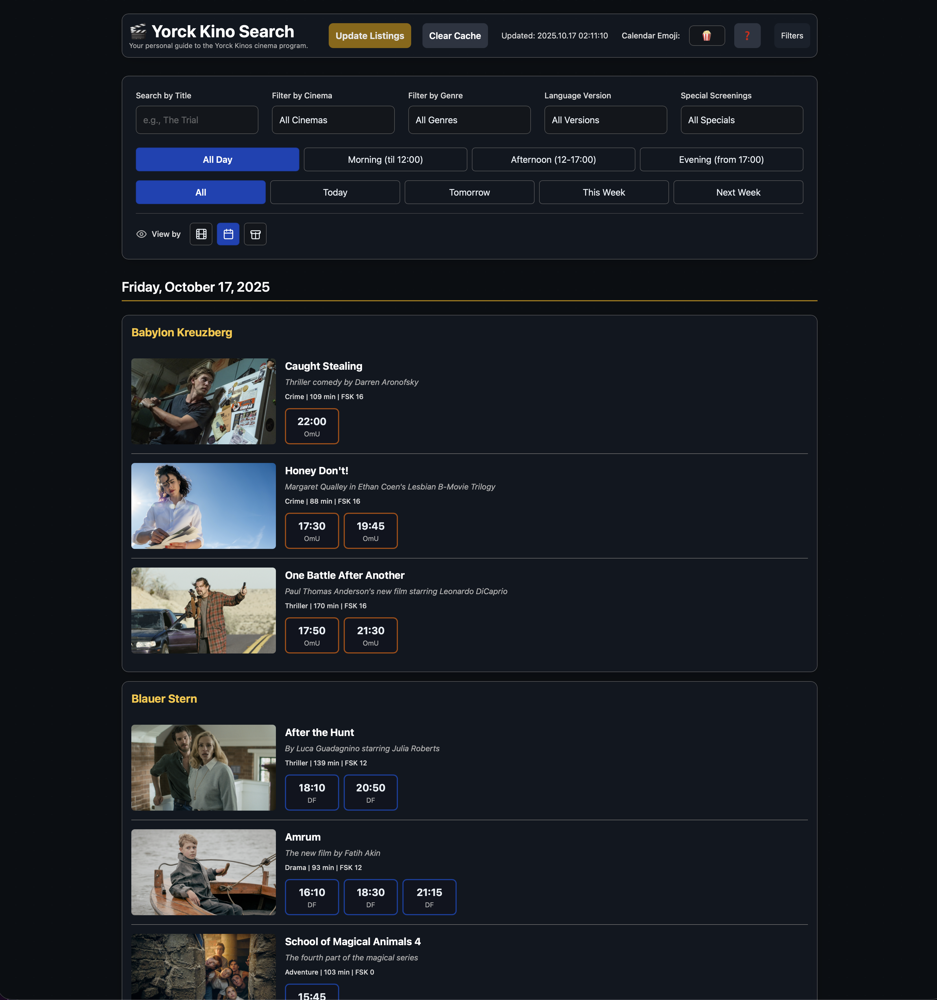

# 🎬 Yorck Kino Search

A modern, filterable, and user-friendly interface for browsing the Yorck Kinos cinema program in Berlin. This tool scrapes data directly from the official website and presents it in a powerful, single-page application that makes finding the perfect movie screening fast and intuitive.

_Recommendation: Replace the placeholder link above with a screenshot of your application's interface._

## ✨ About the Project

This project was born from the desire to have a more powerful and customizable way to browse Berlin's Yorck Kinos film listings. While the official website is great, this tool provides a consolidated view with advanced multi-select filters, customizable result grouping, and calendar integration, all within a sleek, self-contained HTML file.

It's designed for film enthusiasts and regular cinema-goers who want to quickly answer questions like: "What original version (OV) films are playing in Kreuzberg cinemas this weekend?" or "Which dramas are showing after 5 PM tomorrow?"

## 🚀 Features

This application is packed with features designed to create the best possible browsing experience:

-   **Dynamic Data Scraping:** Pulls the latest film and session data directly from the official Yorck website on-demand, ensuring listings are always up-to-date.
-   **Powerful Multi-Select Filtering:** Go beyond simple filters with advanced dropdowns that let you select multiple options at once.
    -   **Filter by Title:** Select one or more specific films to compare showtimes.
    -   **Filter by Cinema:** Choose any combination of Yorck's 14 cinemas.
    -   **Filter by Genre:** Narrow down results to specific genres like Drama, Comedy, or Documentary.
    -   **Filter by Version & Specials:** Easily find films in their Original Version (OV), with subtitles (OmU/OmeU), or special screenings like *Mongay* or *Sneak Previews*.
-   **Quick Toggles:**
    -   **Time of Day:** Instantly filter for screenings in the Morning, Afternoon, or Evening.
    -   **Quick Dates:** Switch between *Today*, *Tomorrow*, *This Week*, and *Next Week* with a single click.
-   **Customizable Result Grouping:** Organize the results exactly how you want them with an intuitive icon-based view switcher.
    -   **Group by Film (Default):** The classic view, showing all times for each film.
    -   **Group by Date:** See what's playing each day, broken down by cinema.
    -   **Group by Cinema:** Plan your visit to a specific cinema by seeing its full daily schedule.
-   **One-Click Calendar Export:** Click on any showtime to instantly download a `.ics` calendar file, complete with film details, cinema location, and runtime.
-   **Customizable Calendar Emoji:** Personalize your calendar events by setting your favorite emoji (e.g., 🍿, 🎬,❓).
-   **Fully Mobile-Responsive:** A sleek, slide-up panel on mobile devices provides access to all filters and settings without sacrificing screen space.
-   **Smart Caching:** Film data is stored in your browser's `localStorage` to provide instant load times on subsequent visits. A "Clear Cache" button lets you fetch fresh data anytime.
-   **Lazy-Loaded Images:** Film posters are loaded as you scroll, ensuring a fast initial page load.

## 🛠️ How It Works

The project is a self-contained vanilla JavaScript application with a few key components:

-   **Frontend:** Plain HTML and JavaScript (ES6+). No frameworks are used, ensuring the application is lightweight and fast.
-   **Styling:** **Tailwind CSS** is loaded via a CDN to provide a modern, utility-first design system.
-   **Data Source:** The application fetches the HTML from the official [Yorck Kinos English website](https://www.yorck.de/en/films) and scrapes the JSON data embedded within the page's `__NEXT_DATA__` script tag.
-   **CORS Proxy:** A public CORS proxy is used to bypass cross-origin restrictions when fetching data from the Yorck website in a browser environment.

## Usage

Using the Yorck Kino Search is simple:

1.  Download the `index.html` file.
2.  Open it in any modern web browser.
3.  Click the **"Load Yorck Website Data"** button to perform the initial data scrape.
4.  Use the comprehensive filter controls to narrow down the listings.
5.  Enjoy the movies!

## 🗺️ Roadmap

This project has a solid foundation, but there are always opportunities for improvement. Here are some ideas for future updates:

-   [ ] **Shareable Filter Links (URL State):** Encode the current filter selections into the URL's query parameters, allowing users to share a direct link to a specific filtered view.
-   [ ] **Save User Preferences:** Use `localStorage` to remember the user's last selected "View by" mode, custom emoji, or even their favorite cinemas between sessions.
-   [ ] **Web Worker for Scraping:** Move the data fetching and parsing process to a background web worker to prevent the UI from freezing during the initial data load.
-   [ ] **PWA Conversion:** Convert the application into a Progressive Web App (PWA) so users can "install" it on their home screen for an app-like experience and potential offline capabilities.
-   [ ] **Enhanced Data Display:**
    -   Clicking a film poster could open a modal with more details (like the full synopsis or trailer).
    -   Add links to external rating sites like IMDb or Letterboxd.
-   [ ] **Accessibility (A11y) Audit:** Perform a thorough review to ensure the application is fully accessible to all users, including those using screen readers.

## 🤝 Contributing

Pull requests and suggestions are welcome! If you have an idea for a new feature or find a bug, please feel free to open an issue or submit a pull request.

## 📄 License

This project is licensed under the **MIT License**. See the `LICENSE` file for details.
